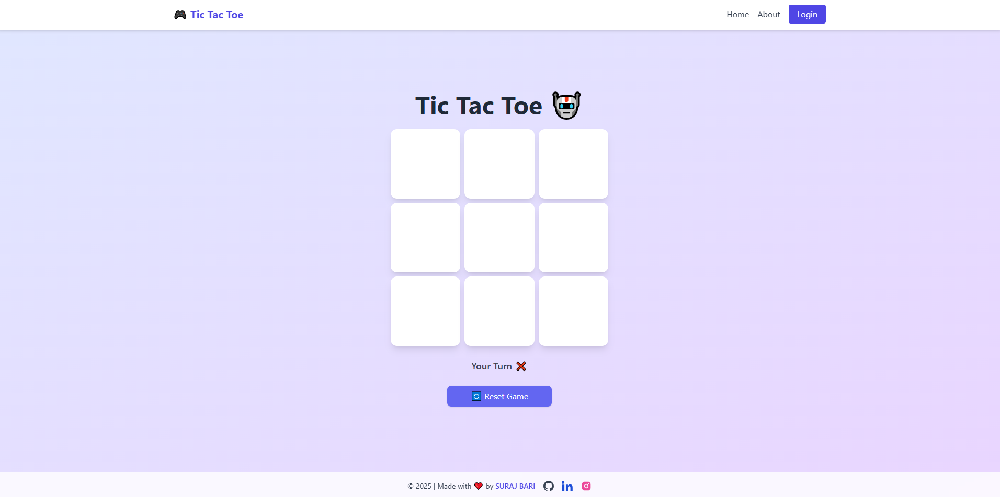

# 🎮 Tic Tac Toe – Classic Game in Modern Code

A fun and interactive Tic Tac Toe game built using HTML, CSS, and JavaScript. This lightweight project is perfect for casual play, beginner coding practice, or portfolio demonstration.

---
## 🔗 Live Demo

👉 [Play Now on Vercel](https://tik-tak-teo.vercel.app/)

---

## 📸 Preview

 <!-- Replace with actual screenshot if available -->

---

## ✨ Features

- ✅ Two-player game mode
- 📱 Responsive design – works on all screen sizes
- 🧠 Smart win/tie detection logic
- 🎯 Highlights the winning combination
- 🔁 Instant restart button for new rounds
- 💡 Clean UI with smooth transitions

---

## 🚀 Technologies Used

- HTML5  
- CSS3 *(or Tailwind CSS if applied)*  
- JavaScript (Vanilla)
- 
---

## 🛠️ How to Run Locally

1. **Clone the repository**

```bash
git clone https://github.com/your-username/tic-tac-toe.git
cd tic-tac-toe
index.html

---
📄 License
This project is licensed under the MIT License.
🙌 Contributions
Contributions, issues, and feature requests are welcome! Feel free to check the issues page if you'd like to help improve this project.

## 📂 Project Structure
🧑‍💻 Author
👤 SURAJ BARI
